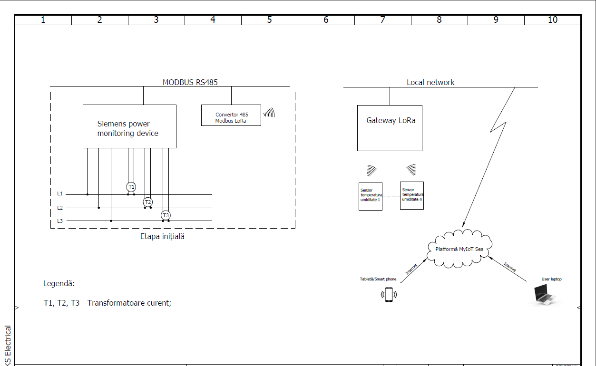

## Monitoring, Controlling, and Cost reducing: Energy, Water, and Gas consumption
### IoT Solution by LoRaWAN for [***McDonald’s restaurants***](https://www.mcdonalds.ro/restaurante)
---

Since last year, we have been working on a proof of concept. It was offered to McDonald's that they reduce their energy consumption. In addition, they consume other resources such as water, gas, etc. In one of their restaurants, we installed the LoRaWAN network. As a first step, we used five Eastron energy meters to collect energy-related data and observe the average consumption over twenty-four hours. By setting a threshold, if the energy consumption exceeds the limit, a mail notification will be sent if the consumption exceeds the limit. Customers will be informed about their unnecessary consumption by receiving this notification. By doing this, they can save 15% to 20% on their total energy costs. We use Thingsboard as a platform for the Internet of Things and LoRaWAN as a technology for sensor communications. In this year, they approved our proof of concept, and we are now working with their other restaurants in Romania.
 

There are two parts to our project: one is the hardware, and the other is the software. Our team consists of five members. The software part of the project is being handled by me and one of my colleagues. The device configurations are prepared in order to send data to the network server through the Lorawan gateway. In this solution, we use the chirpstack network server. Data is encrypted by the Lorawan gateway before it is sent to the network server. As device documentation, we write JavaScript code to decode the payload. Following decoding, we integrate the values into the application server, which is (https://thingsboard.io/. In the thingsboard, we will get all the values from the device's latest telemetry. Using telemetry, we can create a beautiful dashboard for data visualization and redirect values to it. In the meantime, we can create a rule chain to process the values, such as aggregating data, calculating daily and monthly consumption, alerting customers when a critical situation arises, etc.

  

---

### Final Dashboard

---
### Project Agenda

-	To monitor and control the Energy consumption,

- Indoor and Outdoor temperature and humidity, 

- People counting, 

- Water and Gas consumption. 
---

### Technologies

- `Famous IoT platform (SaaS)`
- `ChirpStack Network server`
- `MQTT` `HTTP`
- `LoRaWAN network`
- `PostgreSQL (free and open-source relational database) `

### Hardware

- `Dragino rs485 to Lorawan converter` 
- `Eastron energy meter`
- `Mikrotik Gateway` 
- `Internet switch access port` 
- `LoRa temperature sensor (Adeunis)` 
- `Natural gas meter`
- `Water meter (Bmeter)` 
- `Tetrapolar circuit breaker` 
- `current transformer`

---

### Restaurant plan

With the restaurant plan, it is easy for us to figure out where we will set all the devices. We need a strong Wi-Fi connection with no interruption. LoRaWAN networks cannot function without the internet. Also, we haven't any right to change their main design so we have to consider a lot of things with the existing design.
 

  
  ---

🚩 Connect with me on social
- LinkedIn: [LinkedIn](https://www.linkedin.com/in/ariful-islam-arif-2987b51a3/)
- Twitter: [Twitter](https://twitter.com/arifulislam301)
- Instagram: [Instagram](https://www.instagram.com/ariful_mr_islam/)

🔔 Subscribe to my YouTube channel: [YouTube](https://www.youtube.com/channel/UCED68cm6nHaAlAk0h9I3yAQ)
